# 06. Database Schema (baru)

PostgreSQL 16. Skema ini menggantikan 81 tabel MySQL lama (inventaris di [Lampiran B](analysis/database-inventory.md)) dengan prinsip: `tenant_id` di mana-mana + RLS, `academic_year_id` sebagai scope kedua, satu sistem otorisasi, workflow dan kebijakan yang dapat dikonfigurasi, tanpa trigger bisnis, tanpa enum Postgres (pakai `text` + `CHECK` atau tabel lookup), UUID v7, `timestamptz` UTC, audit dan soft delete yang konsisten.

## 1. Konvensi

| Hal          | Aturan                                                                                                                                                                                                                              |
| ------------ | ----------------------------------------------------------------------------------------------------------------------------------------------------------------------------------------------------------------------------------- |
| PK           | `id uuid primary key default uuidv7()` (fungsi disediakan migrasi 000)                                                                                                                                                              |
| Tenant       | `tenant_id uuid not null references tenants(id)`; index komposit `(tenant_id, ...)` di depan; policy RLS `tenant_isolation` di setiap tabel bertenant                                                                               |
| Tahun ajaran | `academic_year_id uuid not null` di tabel operasional; FK ke `academic_years` `ON DELETE RESTRICT`                                                                                                                                  |
| Waktu        | `created_at timestamptz not null default now()`, `updated_at timestamptz not null default now()` (trigger `set_updated_at` satu-satunya trigger), `created_by uuid null references users(id) on delete set null`, `updated_by` sama |
| Soft delete  | `deleted_at timestamptz null` hanya pada: users, classes, subjects, rooms, violation_types, duty_types, library_bibliographies, library_items, announcements, document_templates. Tabel lain memakai status atau arsip              |
| Status       | `status text not null check (status in (...))`                                                                                                                                                                                      |
| Nama         | tabel jamak snake_case; FK `<singular>_id`; index `ix_<tabel>_<kolom>`; unique `ux_`; check `ck_`; FK constraint `fk_<tabel>_<ref>`                                                                                                 |
| Uang         | `bigint` dalam satuan terkecil (rupiah)                                                                                                                                                                                             |
| JSON         | `jsonb` dengan validasi di aplikasi; hanya untuk snapshot dan konfigurasi bertipe                                                                                                                                                   |
| Teks         | `text` dengan `CHECK (length(...) <= n)` bila perlu batas                                                                                                                                                                           |

Contoh RLS:

```sql
alter table classes enable row level security;
alter table classes force row level security;
create policy tenant_isolation on classes
  using (tenant_id = current_setting('app.tenant_id')::uuid)
  with check (tenant_id = current_setting('app.tenant_id')::uuid);
```

Role DB `app_rw` tanpa `BYPASSRLS`; migrasi memakai role `app_migrate`. Konsol platform memakai `app_platform` dengan policy tambahan `platform_admin` yang mengizinkan `current_setting('app.platform_admin') = 'true'`.

## 2. Domain: platform dan tenant

```sql
tenants (id, slug unique, name, education_level text check in ('sd','smp','sma','smk','other'),
         timezone text default 'Asia/Makassar', locale text default 'id', status text check in ('trial','active','suspended','offboarding','deleted'),
         plan text, primary_domain text unique null, created_at, updated_at)
tenant_domains (id, tenant_id, domain unique, verified_at, verification_token, is_primary)
tenant_settings (tenant_id, key text, value jsonb, updated_by, updated_at, primary key (tenant_id, key))
   -- key terdaftar di kode dengan JSON Schema: branding.name, branding.logo_asset_id, branding.accent_color,
   -- attendance.correction_days, auth.session_days, auth.require_2fa_admin, modules.<name>.enabled, notifications.whatsapp.*, ...
tenant_policies (tenant_id, kind text, version int, config jsonb, effective_from date, created_by, created_at,
                 primary key (tenant_id, kind, version))
   -- kind: attendance_statuses, discipline_levels, late_arrival_actions, grading, calendar, permits, document_numbering
platform_settings (key primary key, value jsonb, updated_at)
platform_admins (user_id primary key, granted_at, granted_by)
feature_flags (tenant_id, module text, enabled bool, config jsonb, primary key (tenant_id, module))
assets (id, tenant_id, bucket, object_key unique, mime, size_bytes, sha256, kind text check in ('avatar','branding','evidence','document','cover','import','export'),
        visibility text check in ('private','tenant_public'), created_by, created_at, deleted_at)
audit_logs (id, tenant_id null, actor_user_id null, acting_as_user_id null, action text, entity_type text, entity_id uuid null,
            before jsonb null, after jsonb null, ip inet, user_agent text, request_id text, occurred_at)  -- partisi bulanan, append-only
```

## 3. Domain: identitas dan akses

```sql
users (id, tenant_id, username, email null, phone null, password_hash, name, status text check in ('active','inactive','invited'),
       must_change_password bool, last_login_at, locale, avatar_asset_id, created_at, updated_at, deleted_at,
       unique (tenant_id, username), unique (tenant_id, email), unique (tenant_id, phone))
user_profiles (user_id primary key, kind text check in ('student','teacher','staff','parent'), nik, gender, birth_place, birth_date,
               religion, address, district, city, blood_type, extra jsonb, created_at, updated_at)
student_profiles (user_id primary key, tenant_id, nis, nisn, entry_year smallint, previous_school, father_name, mother_name,
                  guardian_name, guardian_phone, parent_occupation, unique (tenant_id, nis), unique (tenant_id, nisn))
teacher_profiles (user_id primary key, tenant_id, nip, nuptk, employment_status, last_education, joined_year, specialization)
staff_profiles (user_id primary key, tenant_id, employee_number, position, employment_status, last_education, joined_year)
parent_students (parent_user_id, student_user_id, relation text check in ('father','mother','guardian'), can_approve_leave bool,
                 primary key (parent_user_id, student_user_id))
roles (id, tenant_id, slug, name, description, is_system bool, created_at, updated_at, unique (tenant_id, slug))
permissions (code primary key, group_name, description)              -- katalog statis, di-seed dari kode
role_permissions (role_id, permission_code, primary key (role_id, permission_code))
user_roles (user_id, role_id, is_primary bool, academic_year_id null, primary key (user_id, role_id))
duty_types (id, tenant_id, slug, name, scope_kind text check in ('school','class','student'), is_active, deleted_at, unique (tenant_id, slug))
   -- contoh slug: homeroom, counselor, picket, leadership, security, librarian
duty_permissions (duty_type_id, permission_code, primary key (duty_type_id, permission_code))
   -- menggantikan boolean grants_*; permission diberikan saat duty aktif
duty_assignments (id, tenant_id, academic_year_id, duty_type_id, user_id, scope_class_id null, scope_student_id null, is_active,
                  starts_on, ends_on, created_at, unique (academic_year_id, duty_type_id, user_id, scope_class_id, scope_student_id))
sessions (id, tenant_id, user_id, kind text check in ('login','impersonation'), actor_user_id null, refresh_token_hash bytea unique,
          family_id uuid, client text check in ('web','ios','android'), device_id, device_name, user_agent, ip inet,
          created_at, last_seen_at, expires_at, revoked_at, revoked_reason)
mfa_totp (user_id primary key, secret_encrypted bytea, confirmed_at, recovery_codes_hash text[])
webauthn_credentials (id, user_id, credential_id bytea unique, public_key bytea, sign_count bigint, transports text[], name, created_at, last_used_at)
password_resets (id, user_id, token_hash unique, channel text, expires_at, used_at)
login_attempts (id, tenant_id, username, ip inet, success bool, occurred_at)  -- partisi, retensi 90 hari
impersonation_actions (id, session_id, method, path, occurred_at)
```

Otorisasi efektif = permission dari role aktif union permission dari duty aktif pada tahun aktif; scope (kelas/siswa) dievaluasi service. Permission `review_leave_requests` misalnya berasal dari `duty_permissions(homeroom)`, dan scope-nya adalah `duty_assignments.scope_class_id`. Ini menghilangkan dua sistem paralel dan bug "notifikasi BK tidak terkirim".

## 4. Domain: struktur akademik

```sql
academic_years (id, tenant_id, label, starts_on, ends_on, is_active, unique (tenant_id, label))
   -- constraint unik parsial: create unique index ux_active_year on academic_years (tenant_id) where is_active
terms (id, academic_year_id, tenant_id, name, sequence smallint, starts_on, ends_on, is_active)   -- semester/trimester
academic_calendar_events (id, tenant_id, academic_year_id, date, kind text check in ('holiday','exam','event','no_school'), name)
grade_levels (id, tenant_id, code, name, sequence)                    -- X, XI, XII atau 1..6
tracks (id, tenant_id, code, name)                                    -- IPA, IPS, jurusan SMK (opsional)
classes (id, tenant_id, academic_year_id, grade_level_id, track_id null, name, room_id null, capacity, homeroom_teacher_id null,
         unique (academic_year_id, name), deleted_at)
enrollments (id, tenant_id, academic_year_id, student_user_id, class_id, status text check in ('active','moved','graduated','left'),
             joined_on, left_on, created_at)
   -- unik parsial: satu aktif per siswa per tahun: unique (academic_year_id, student_user_id) where status = 'active'
subjects (id, tenant_id, code, name, deleted_at, unique (tenant_id, code))
subject_offerings (id, tenant_id, academic_year_id, subject_id, grade_level_id null, hours_per_week)
rooms (id, tenant_id, code, name, capacity, deleted_at)
period_templates (id, tenant_id, name, is_default)
periods (id, tenant_id, template_id, name, sequence, starts_at time, ends_at time, is_break bool, check (starts_at < ends_at),
         unique (template_id, sequence))
period_day_assignments (tenant_id, academic_year_id, day_of_week smallint check between 1 and 7, template_id, primary key (academic_year_id, day_of_week))
school_days (tenant_id, academic_year_id, day_of_week, is_active, primary key (academic_year_id, day_of_week))
teaching_assignments (id, tenant_id, academic_year_id, teacher_user_id, subject_id, class_id, is_active,
                      unique (academic_year_id, teacher_user_id, subject_id, class_id))
```

## 5. Domain: jadwal

```sql
schedules (id, tenant_id, academic_year_id, term_id null, class_id, subject_id, teacher_user_id, room_id null, day_of_week,
           start_period_id, end_period_id, source text check in ('admin','teacher','import'), notes, created_by, updated_by,
           created_at, updated_at)
   -- exclusion constraint anti bentrok memakai int4range atas sequence periode:
   --   exclude using gist (class_id with =, day_of_week with =, period_range with &&) where (academic_year_id = ...)
   --   exclude using gist (teacher_user_id with =, day_of_week with =, period_range with &&)
   --   period_range int4range generated always as (int4range(start_seq, end_seq, '[]')) stored
substitution_requests (id, tenant_id, academic_year_id, schedule_id, date, requester_user_id, substitute_user_id,
                       status text check in ('pending','accepted','rejected','cancelled'), requester_note, response_note, responded_at,
                       created_at, unique (schedule_id, date) where status in ('pending','accepted'))
class_journals (id, tenant_id, academic_year_id, teacher_user_id, written_by_user_id, class_id, subject_id, lesson_date, topic,
                activities, reflection, attendance_session_id null, created_at, updated_at,
                unique (academic_year_id, teacher_user_id, class_id, subject_id, lesson_date))
```

## 6. Domain: presensi

```sql
attendance_sessions (id, tenant_id, academic_year_id, schedule_id, date, class_id, subject_id, teacher_user_id,
                     substitute_user_id null, start_period_id, end_period_id, submitted_at, submitted_by, notes,
                     created_at, updated_at, unique (schedule_id, date))
attendance_entries (id, tenant_id, session_id, student_user_id, status_code text, source text check in ('teacher','leave','permit','system'),
                    notes, recorded_by, created_at, updated_at, unique (session_id, student_user_id))
   -- status_code divalidasi terhadap tenant_policies(kind='attendance_statuses'); default H/S/I/D/A
attendance_corrections (id, tenant_id, entry_id, old_status, new_status, reason, corrected_by, corrected_at)
attendance_daily_summary (tenant_id, academic_year_id, student_user_id, date, status_code, expected_sessions, submitted_sessions,
                          computed_at, primary key (academic_year_id, student_user_id, date))
   -- materialisasi oleh job setelah setiap submit; satu algoritma domain untuk kalender, wali kelas, laporan
```

## 7. Domain: workflow perizinan (izin keluar, terlambat, izin terencana)

```sql
workflow_definitions (id, tenant_id, kind text check in ('exit_permit','late_arrival','leave_request'), version int, is_active,
                      stages jsonb, config jsonb, created_by, created_at, unique (tenant_id, kind, version))
   -- stages: [{key:'duty_teacher', label, approver_rule:'duty:picket|any_teacher', verification:'qr_scan', distinct_from:[...]},
   --          {key:'class_teacher', approver_rule:'teacher_of_class_now', lookahead_slots:2}, {key:'bk', approver_rule:'duty:counselor'},
   --          {key:'leadership', approver_rule:'duty:leadership'}]
workflow_instances (id, tenant_id, academic_year_id, definition_id, kind, subject_user_id, class_id, current_stage_index int,
                    status text check in ('in_progress','approved','rejected','completed','cancelled','expired'),
                    payload jsonb, opened_at, closed_at, created_by, created_at, updated_at)
workflow_events (id, tenant_id, instance_id, stage_key null, from_status, to_status, actor_user_id null, verification text,
                 scan_token_id null, note, occurred_at)
exit_permits (instance_id primary key, tenant_id, destination, start_period_id, end_period_id, issued_at, gate_token_id null,
              exited_at, security_user_id null, student_name_snapshot, class_name_snapshot)
late_arrivals (instance_id primary key, tenant_id, reason, occurrence_number int, required_action text, homeroom_reported bool,
               completed_at)
leave_requests (instance_id primary key, tenant_id, category text, reason, starts_on, ends_on, letter_number null, issued_at,
                issued_by null, parent_approved_at null, student_name_snapshot, class_name_snapshot, guardian_name_snapshot,
                check (ends_on >= starts_on))
leave_documents (id, tenant_id, leave_request_id, kind text check in ('evidence','letter'), asset_id, created_by, created_at,
                 unique (leave_request_id, kind))
scan_tokens (id, tenant_id, purpose text check in ('classroom_entry','late_arrival','approve_stage','gate_exit','library_visit',
             'library_self_service','library_opname','kiosk'), context_id uuid null, issued_by_user_id, token_hash bytea unique,
             expires_at, consumed_at, consumed_by_user_id null, created_at)
   -- index (tenant_id, purpose, expires_at) where consumed_at is null; job pembersihan harian
```

Aturan "satu izin keluar per hari" dan "tidak boleh ada yang belum selesai" menjadi `config` definisi, ditegakkan service dengan unique index parsial `(subject_user_id, kind, date(opened_at)) where status = 'in_progress'`.

## 8. Domain: disiplin dan konseling

```sql
violation_types (id, tenant_id, code, name, points int check (points >= 0), category, is_active, deleted_at, unique (tenant_id, code))
violation_records (id, tenant_id, academic_year_id, student_user_id, violation_type_id, points_snapshot int, occurred_on,
                   attendance_session_id null, workflow_instance_id null, reporter_user_id, notes, created_at, updated_at,
                   voided_at null, voided_by null, void_reason null)
warning_letters (id, tenant_id, academic_year_id, student_user_id, level int, level_label, threshold_points, total_points,
                 letter_number, issued_by, issued_at, snapshot jsonb, document_asset_id null,
                 unique (academic_year_id, student_user_id, level), unique (tenant_id, academic_year_id, letter_number))
counselings (id, tenant_id, academic_year_id, student_user_id, counselor_user_id, session_at, kind, title,
             content_encrypted bytea, content_key_id, follow_up_plan_encrypted bytea, visibility text check in ('counselor','bk_team','leadership'),
             created_at, updated_at)
counseling_attachments (id, counseling_id, asset_id, created_at)
```

## 9. Domain: penilaian

```sql
assessment_components (id, tenant_id, academic_year_id, term_id, teacher_user_id, class_id, subject_id, code, kind, description,
                       kktp numeric(5,2) null, weight numeric(5,2), sequence, created_at, updated_at,
                       unique (academic_year_id, term_id, class_id, subject_id, code))
grades (id, tenant_id, component_id, student_user_id, score numeric(6,2), recorded_by, created_at, updated_at,
        unique (component_id, student_user_id))
grade_publications (id, tenant_id, academic_year_id, term_id, class_id, subject_id, is_published, published_at, published_by,
                    unique (academic_year_id, term_id, class_id, subject_id))
report_scores (id, tenant_id, academic_year_id, term_id, class_id, subject_id, student_user_id,
               previous_score numeric(6,2) null, manual_score numeric(6,2) null, final_score numeric(6,2), computed_at,
               unique (academic_year_id, term_id, class_id, subject_id, student_user_id))
report_grade_ranges (id, tenant_id, academic_year_id, subject_id null, teacher_user_id null, min_score, max_score, increase_amount,
                     check (min_score <= max_score))
report_tp_mappings (id, tenant_id, component_id unique, export_code, r_min, r_max, t_min, t_max)
star_events (id, tenant_id, academic_year_id, class_id, subject_id, student_user_id, teacher_user_id, delta int check (delta <> 0),
             note, visible_to_student, created_at)
   -- saldo = sum(delta); constraint saldo >= 0 ditegakkan service dengan advisory lock per siswa
```

## 10. Domain: komunikasi

```sql
announcements (id, tenant_id, sender_user_id, title, body_html, body_text, audience jsonb, starts_at, ends_at, is_pinned,
               status text check in ('draft','scheduled','published','archived'), published_at, created_at, updated_at, deleted_at)
announcement_reads (announcement_id, user_id, read_at, primary key (announcement_id, user_id))
notifications (id, tenant_id, user_id, kind, title, body, href, data jsonb, announcement_id null, read_at, created_at)
   -- index (user_id, read_at, created_at desc); partisi bulanan; retensi 180 hari
notification_preferences (user_id, kind, channel text check in ('inapp','push','whatsapp','email'), enabled, primary key (user_id, kind, channel))
push_devices (id, tenant_id, user_id, platform text check in ('web','ios','android'), token_or_endpoint text, endpoint_hash bytea unique,
              p256dh, auth_key, device_name, failure_count, last_used_at, expires_at, created_at)
message_deliveries (id, tenant_id, notification_id, channel, provider, status, provider_message_id, error, attempts, sent_at, created_at)
```

Job pengiriman memakai tabel River (`river_job`) yang dibuat oleh library; tidak ada outbox buatan sendiri.

## 11. Domain: dokumen

```sql
document_templates (id, tenant_id, kind text check in ('leave_letter','warning_letter','class_journal','member_card','item_label',
                    'clearance_letter','report'), name, engine text check in ('html','docx'), body, variables jsonb, is_default,
                    created_by, created_at, updated_at, deleted_at)
document_sequences (tenant_id, kind, academic_year_id, next_value bigint, primary key (tenant_id, kind, academic_year_id))
   -- diambil dengan UPDATE ... RETURNING dalam transaksi penerbitan
issued_documents (id, tenant_id, kind, entity_type, entity_id, number, asset_id, sha256, verification_code_hash bytea unique,
                  issued_by, issued_at, revoked_at)
```

## 12. Domain: perpustakaan

Mengikuti skema modul perpustakaan versi lokal dengan penyesuaian konvensi: setiap tabel mendapat `tenant_id`; `library_holidays` digabung ke `academic_calendar_events`; `subjects` bibliografi menjadi tabel `library_subjects` + `library_bibliography_subjects`; `library_members.user_id` tetap PK; status Indonesia diganti kode English dengan label i18n (`available`, `on_loan`, `reserved`, `damaged`, `lost`, `repair`, `processing`, `donated`, `reserve_stack`, `unknown`).

Tabel: `library_material_types`, `library_collection_categories`, `library_acquisition_sources`, `library_locations`, `library_partners`, `library_ddc_classes` (platform, tanpa tenant), `library_bibliographies` (+ `search_vector tsvector generated` dengan index GIN), `library_marc_fields`, `library_subjects`, `library_bibliography_subjects`, `library_items` (unique `(tenant_id, accession_number)`, `(tenant_id, barcode)`), `library_item_events`, `library_member_types`, `library_members` (unique `(tenant_id, member_no)`), `library_loan_rules`, `library_loans`, `library_loan_items` (kolom generated `active_item_id` + unique dipertahankan), `library_loan_renewals`, `library_bookings`, `library_fines`, `library_stock_opnames`, `library_stock_opname_items`, `library_visits`, `library_read_in_place`.

## 13. ERD ringkas (Mermaid)

```mermaid
erDiagram
  tenants ||--o{ users : has
  tenants ||--o{ academic_years : has
  tenants ||--o{ roles : has
  tenants ||--o{ tenant_settings : has
  tenants ||--o{ tenant_policies : has
  tenants ||--o{ workflow_definitions : has
  users ||--o{ user_roles : has
  roles ||--o{ role_permissions : grants
  duty_types ||--o{ duty_permissions : grants
  duty_types ||--o{ duty_assignments : assigned
  users ||--o{ duty_assignments : holds
  users ||--o{ sessions : has
  users ||--o{ parent_students : parent
  academic_years ||--o{ terms : has
  academic_years ||--o{ classes : has
  classes ||--o{ enrollments : enrolls
  users ||--o{ enrollments : student
  academic_years ||--o{ teaching_assignments : has
  period_templates ||--o{ periods : has
  classes ||--o{ schedules : has
  schedules ||--o{ attendance_sessions : instantiates
  attendance_sessions ||--o{ attendance_entries : has
  schedules ||--o{ substitution_requests : has
  workflow_definitions ||--o{ workflow_instances : defines
  workflow_instances ||--o{ workflow_events : logs
  workflow_instances ||--o| exit_permits : detail
  workflow_instances ||--o| late_arrivals : detail
  workflow_instances ||--o| leave_requests : detail
  leave_requests ||--o{ leave_documents : has
  users ||--o{ scan_tokens : issues
  violation_types ||--o{ violation_records : typed
  users ||--o{ warning_letters : issued_to
  users ||--o{ counselings : student
  assessment_components ||--o{ grades : has
  users ||--o{ star_events : student
  announcements ||--o{ announcement_reads : read
  users ||--o{ notifications : receives
  users ||--o{ push_devices : registers
  document_templates ||--o{ issued_documents : renders
  library_bibliographies ||--o{ library_items : copies
  library_members ||--o{ library_loans : borrows
  library_loans ||--o{ library_loan_items : has
  library_items ||--o{ library_loan_items : loaned
  assets ||--o{ leave_documents : file
  tenants ||--o{ audit_logs : logs
```



## 14. Index dan kinerja

- Setiap FK punya index. Index komposit mengikuti pola akses: `attendance_entries (session_id)`, `(student_user_id, created_at)`; `attendance_sessions (academic_year_id, date, class_id)`, `(teacher_user_id, date)`; `notifications (user_id, read_at, created_at desc)`; `workflow_instances (tenant_id, kind, status, opened_at)`; `violation_records (academic_year_id, student_user_id, occurred_on)`; `grades (student_user_id)`.
- Partisi bulanan: `audit_logs`, `notifications`, `login_attempts`, `message_deliveries`.
- Materialisasi: `attendance_daily_summary`, `student_point_totals (academic_year_id, student_user_id, total_points)` diperbarui oleh job atau dalam transaksi pencatatan.
- Full-text: `library_bibliographies.search_vector`, `users.search_vector` (nama, username, NIS) dengan konfigurasi `simple` + unaccent.

## 15. Migrasi dan seed

- `golang-migrate` dengan file `NNNN_name.up.sql` / `.down.sql`, nomor 4 digit monoton, advisory lock bawaan, CI menolak nomor ganda atau celah.
- Migrasi hanya DDL dan data referensi platform (permission catalog, DDC). Data per tenant (policy default, role sistem, duty types, period template) dibuat oleh `tenant bootstrap` di kode saat tenant dibuat, bukan migrasi.
- Migrasi kompatibel mundur: tambah kolom nullable dulu, backfill lewat job, lalu tambah constraint; tidak ada `DROP` pada rilis yang sama dengan kode yang berhenti memakainya.
- Seed contoh (`cmd/seed`) membuat satu sekolah fiktif "SMA Contoh" dengan nama acak dari daftar generik, hanya di `APP_ENV != production`.

## 16. Pemetaan dari skema lama

| Lama                                                                                         | Baru                                                                                             |
| -------------------------------------------------------------------------------------------- | ------------------------------------------------------------------------------------------------ |
| `app_settings`                                                                               | `tenant_settings` + `tenant_policies` + `document_templates`                                     |
| `roles` natural key                                                                          | `roles` per tenant dengan `slug`                                                                 |
| `teacher_additional_duties.grants_*`, `employee_additional_duties`                           | `duty_types` + `duty_permissions` + `duty_assignments`                                           |
| `academic_year_users`                                                                        | dihapus; keanggotaan diturunkan dari enrollment/teaching/duty per tahun, user tetap milik tenant |
| `student_class_assignments`                                                                  | `enrollments` dengan riwayat (satu aktif per tahun, pindah = baris baru)                         |
| `periods` + `period_day_overrides`                                                           | `period_templates` + `periods` + `period_day_assignments`                                        |
| `teaching_schedules`                                                                         | `schedules` dengan exclusion constraint                                                          |
| `attendance_*`                                                                               | sama + `attendance_corrections` + `attendance_daily_summary`                                     |
| `student_exit_permits`, `student_late_arrivals`, `student_leave_requests` + events           | `workflow_instances` + `workflow_events` + tabel detail                                          |
| `teacher_qr_tokens`, gate token kolom, `library_scan_tokens`                                 | `scan_tokens`                                                                                    |
| `violations`, `student_has_violations`, `violation_sp_settings`, `violation_warning_letters` | `violation_types`, `violation_records`, policy `discipline_levels`, `warning_letters`            |
| `counselings`                                                                                | `counselings` terenkripsi dengan FK                                                              |
| grading 8 tabel                                                                              | 8 tabel dengan FK lengkap dan `term_id`                                                          |
| `notifications` + `notification_outbox` + trigger                                            | `notifications` + River                                                                          |
| `push_subscriptions`                                                                         | `push_devices`                                                                                   |
| `user_sessions`                                                                              | `sessions` dengan family dan revoke reason                                                       |
| `user_impersonation_*`                                                                       | `sessions(kind='impersonation')` + `impersonation_actions` + `audit_logs`                        |
| uploads filesystem                                                                           | `assets` + S3                                                                                    |
