# Lampiran B. Inventaris Skema Database dan PRD SION (kode lama)

Sumber: `reference/sion/backend/migrations` (001-042) dan `reference/sion-rebuild-go/backend/migrations` (001-045), `PRD-rebuild-go-nextjs.json`, `DEPLOYMENT.md`, `docker-compose.yml`, `deploy/`. Migrasi 001-042 identik di kedua folder; folder rebuild menambah `043_user_sessions`, `044_library_module`, `045_mobile_push_and_refresh`.

Total tabel: 81 (57 inti + 24 perpustakaan) + `schema_migrations`.

Konvensi lama: PK `VARCHAR(50)` string buatan aplikasi; `utf8mb4_unicode_ci`; `created_at`/`updated_at TIMESTAMP`; teks bebas `VARCHAR(n) NOT NULL DEFAULT ''`; tanpa soft delete.

## 1. Katalog tabel

### 1.1 Auth / RBAC / identitas

**`roles`** (001): `id VARCHAR(50) PK` (natural key: `super_admin`, `admin`, `guru`, `pegawai`, `siswa`, `pustakawan` dari 044), `name`, `description`, timestamps.

**`permissions`** (001): `code VARCHAR(100) PK`, `name`, `description`, `permission_group`, timestamps.

**`role_has_permissions`** (001): PK `(role_id, permission_code)`, FK cascade ke roles dan permissions.

**`users`** (001, 013): `id PK`, `name`, `username UNIQUE`, `email UNIQUE`, `password_hash` (bcrypt), `status ENUM('active','inactive')`, `remember_token`, `active_session_id` (013, single-device), `last_login_at`, timestamps. Tanpa school_id, tanpa soft delete; avatar diturunkan dari nama file `avatar_<userID>.webp`.

**`model_has_roles`** (001, 042): PK `(user_id, role_id)`, `is_primary BOOLEAN` (042, backfill prioritas super_admin > admin > guru > pegawai > siswa), index `(user_id, is_primary)`.

**`user_details`** (002, tanpa down): `user_id PK` FK users cascade, `nik`, `full_name`, `gender ENUM('L','P')`, `birth_place`, `birth_date`, `religion`, `address`, `district`, `city`, `phone`, `blood_type ENUM('A','B','AB','O','-')`, `profile_photo`. Tanpa timestamps.

**`student_details`** (002): `user_id PK` FK ke `user_details` (bukan users), `nis`, `nisn` (tidak unik, tidak terindeks), `entry_year YEAR`, `father_name`, `mother_name`, `guardian_name`, `guardian_phone`, `parent_occupation`, `previous_school`.

**`employee_details`** (002): `employee_number`, `position`, `last_education`, `employment_status ENUM('PNS','PPPK','GTY','Tetap','Kontrak','Honorer')`, `joined_year`, `is_supervisor`.

**`teacher_details`** (002): `nip`, `nuptk`, `last_education`, `employment_status ENUM('PNS','PPPK','GTY','Honorer')` (set enum berbeda dari employee), `joined_year`, `teaching_specialization`, `is_supervisor`.

**`teacher_qr_tokens`** (023): `id VARCHAR(80) PK`, `teacher_user_id` FK users (restrict), `token_hash CHAR(64) UNIQUE` (SHA-256), `expires_at`, `consumed_at`, `created_at`. TTL 30 detik, sekali pakai. Tanpa kolom `purpose`.

**`user_login_events`** (031): `id BIGINT AUTO_INCREMENT`, `user_id` FK cascade, `role_id` (tanpa FK), `logged_at`.

**`user_impersonation_events`** (039): `id`, `actor_user_id`, `target_user_id` (FK restrict), `ip_address`, `user_agent`, `started_at`, `expires_at`, `ended_at`.

**`user_impersonation_actions`** (039): log per request selama impersonasi: `impersonation_id` FK cascade, `method`, `request_path`, `ip_address`, `occurred_at`.

**`user_sessions`** (043, 045; rebuild saja): `id`, `user_id`, `kind ENUM('login','impersonation')`, `refresh_token_hash CHAR(64) UNIQUE`, `refresh_expires_at`, `client VARCHAR(20) DEFAULT 'web'`, `device_id`, `device_name`, `user_agent`, `ip_address`, `created_at`, `last_seen_at`, `expires_at`, `revoked_at`. Index `(user_id, revoked_at, expires_at)`.

### 1.2 Struktur akademik dan master data

**`academic_years`** (002): `id VARCHAR(36) PK`, `year_label` ("2026/2027"), `semester ENUM('ganjil','genap')`, `is_active`, timestamps nullable. UNIQUE `(year_label, semester)`. Ini kunci scope de facto seluruh sistem. Tanpa `start_date`/`end_date` (padahal PRD meminta); tidak ada penegakan hanya satu yang aktif.

**`academic_year_users`** (004, tanpa down): PK `(academic_year_id, user_id)`; migrasi backfill CROSS JOIN semua user ke tahun aktif.

**`subjects`** (004), **`rooms`** (005), **`classes`** (005): `id`, `academic_year_id` FK cascade, `name`, timestamps; UNIQUE `(academic_year_id, name)`. `rooms` tidak pernah direferensikan FK manapun. `classes` tanpa tingkat, wali kelas, kapasitas.

**`periods`** (006): `academic_year_id`, `name`, `start_time TIME`, `end_time TIME`, `sort_order`, `is_active`; UNIQUE `(year, sort_order)` dan `(year, name)`; CHECK start < end.

**`period_day_overrides`** (006): `day_of_week VARCHAR(12)` (tanpa CHECK), `period_id`, `mode VARCHAR(30) DEFAULT 'custom'`, `effective_start_time`, `effective_end_time`, `is_active`; UNIQUE `(year, day, period)`. Mengkodekan "mode Jumat 40 menit".

**`violations`** (katalog, 007): `academic_year_id`, `name`, `points INT CHECK >= 0`; UNIQUE `(year, name)`. Tanpa `is_active` (kode `late_arrivals.go:375` mengkuerinya: bug). Tidak ada seed katalog.

**`teacher_additional_duties`** (008 + 017, 019, 025, 029): `id`, `academic_year_id`, `name`, `grants_all_attendance_reports`, `grants_leave_homeroom_review`, `grants_leave_issuance`, `is_active`, `grants_exit_bk_approval`, `grants_exit_leadership_approval`, `grants_late_arrival_duty`, `grants_late_arrival_leadership`, timestamps. UNIQUE `(year, name)`. Ini sistem otorisasi paralel kedua (boolean per kemampuan). Migrasi 019 dan 026 mengisi boolean ini dengan mencocokkan nama tugas berbahasa Indonesia (`wali kelas`, `bk`, `wakasek`, dst).

**`teacher_duty_assignments`** (009): `academic_year_id`, `teacher_user_id`, `duty_id`, `scope_type ENUM('global','class','student','custom')`, `scope_id` (polimorfik tanpa FK), `scope_label`, `is_active`; UNIQUE `(year, teacher, duty, scope_type, scope_id)`.

**`employee_additional_duties`** (030): `academic_year_id`, `name`, `grants_exit_security`, `is_active`; seed satu baris `Security` per tahun ajaran (`employee-duty-security-<year>`).

**`employee_duty_assignments`** (030): `(year, employee, duty)` unik.

**`teacher_subject_assignments`** (010): `(year, teacher, subject, class)` unik, `is_active`; index per teacher, subject, class.

**`student_class_assignments`** (011): `academic_year_id`, `student_user_id`, `class_id`, `status ENUM('active','moved','graduated','inactive')`, `joined_at`, `left_at`; UNIQUE `(year, student)`: satu kelas per siswa per tahun, pindah kelas menimpa riwayat.

### 1.3 Jadwal

**`teaching_schedules`** (012): `academic_year_id`, `day_of_week` CHECK monday..sunday, `class_id`, `teacher_user_id`, `subject_id`, `start_period_id`, `end_period_id`, `source` CHECK ('admin','teacher'), `notes`, `created_by`, `updated_by` (FK users **cascade**: menghapus admin menghapus jadwal), timestamps. Tanpa unique anti bentrok (dicek di Go). Tanpa `room_id`.

**`teacher_substitution_requests`** (032): `teaching_schedule_id`, `requester_user_id`, `substitute_user_id`, `request_date`, `status` CHECK pending|accepted|rejected|cancelled, `requester_note`, `response_note`, `responded_at`; UNIQUE menyertakan `status`.

**`class_journals`** (028): `teacher_user_id`, `class_id`, `subject_id`, `lesson_date`, `topic`, `activities TEXT`, `reflection TEXT`; UNIQUE `(year, teacher, class, subject, date)`.

### 1.4 Presensi

**`attendance_sessions`** (014, 017): `academic_year_id`, `attendance_date`, `teaching_schedule_id`, `class_id`, `teacher_user_id`, `subject_id`, `start_period_id`, `end_period_id`, `notes`, `submitted_at` (017; NULL = draf), `created_by`, `updated_by`, timestamps. UNIQUE `(year, date, schedule)`. Sembilan FK semuanya cascade.

**`attendance_entries`** (014, 015): `session_id`, `student_user_id`, `status CHAR(1)` CHECK H/S/I/D/A (Hadir, Sakit, Izin, Dispensasi, Alpha), `notes`; UNIQUE `(session, student)`. Tidak ada status "terlambat".

### 1.5 Izin, dispensasi, terlambat

**`student_leave_requests`** (019): `academic_year_id`, `student_user_id`, `class_id` (restrict), `student_name_snapshot`, `class_name_snapshot`, `guardian_name_snapshot`, `category ENUM('religious_ceremony','sick','dispensation','other')`, `reason`, `start_date`, `end_date` CHECK, `status ENUM('pending_homeroom','pending_bk','issued','rejected')`, `homeroom_user_id` (restrict), `homeroom_note`, `homeroom_reviewed_at`, `issued_by_user_id` (set null), `letter_number UNIQUE` (global, format `SION/IZIN/YYYYMMDD/<hex>`), `issued_at`, timestamps.

**`student_leave_documents`** (019): `request_id`, `document_type ENUM('application_evidence','issued_letter')`, `storage_name`, `original_name`, `mime_type`, `size_bytes`, `created_by`; UNIQUE `(request, type)`.

**`student_leave_events`** (019): `request_id`, `actor_user_id`, `from_status`, `to_status` (string, bukan enum), `note`, `created_at`.

**`student_exit_permits`** (024 tanpa down, 026): `academic_year_id`, `student_user_id`, `class_id`, snapshot nama dan kelas, `destination`, `start_period_id`, `end_period_id`, `status ENUM('pending_duty_teacher','pending_class_teacher','pending_bk','pending_leadership','issued','exited')`, `duty_teacher_user_id`, `class_teacher_user_id`, `bk_user_id`, `leadership_user_id` (empat kolom tanpa FK), `gate_token_hash`, `gate_token_expires_at` (026), `issued_at`, `exited_at`, `security_user_id` (FK set null), timestamps. Tanpa status ditolak.

**`student_exit_permit_events`** (024): `permit_id`, `actor_user_id`, `stage`, `note`, `created_at`.

**`student_late_arrivals`** (029, 037): `academic_year_id`, `student_user_id`, `class_id`, `reason VARCHAR(500) DEFAULT 'Terlambat datang ke sekolah'` (037), `status ENUM('pending_duty_teacher','pending_leadership','pending_class_teacher','completed')`, `late_count`, `required_action ENUM('none','call_parent','send_home')`, `homeroom_reported`, tiga kolom aktor tanpa FK, `created_at`, `completed_at`, `updated_at`. UNIQUE `(year, student, created_at)` tidak berguna karena created_at timestamp penuh. Aturan di Go: terlambat ke-2 dan ke-5 `call_parent`, ke-3 dan ke-6 `send_home`.

### 1.6 Disiplin

**`student_has_violations`** (016, 027): `id VARCHAR(80)`, `academic_year_id`, `student_user_id`, `violation_id`, `reporter_user_id` (semua cascade), `attendance_session_id` (set null), `occurred_date`, `notes VARCHAR(1000)` (027), `created_at` (tanpa updated_at). UNIQUE `(session, student, violation)` hanya efektif bila session tidak NULL.

**`violation_sp_settings`** (036): `academic_year_id PK`, `sp1_min_points 25`, `sp2_min_points 50`, `sp3_min_points 75`, `updated_by_user_id`; CHECK urutan naik.

**`violation_warning_letters`** (037): `academic_year_id`, `student_user_id`, `sp_level VARCHAR(10)` CHECK 'SP 1','SP 2','SP 3' (string tampilan dengan spasi sebagai kunci), `letter_number`, `total_points`, `issued_by_user_id`, `issued_at`, `snapshot_json LONGTEXT`. UNIQUE `(year, student, level)` dan `(year, letter_number)`. Nomor dari template `{{sequence}}/{{sp_level_number}}/{{month_roman}}/{{year}}`; sequence `COUNT(*)+1`.

### 1.7 Konseling

**`counselings`** (038, dan juga dibuat saat runtime oleh `counseling.go:204`): semua id `VARCHAR(255)`, `counseling_date DATETIME`, `counseling_type` (karir, pribadi, belajar, sosial), `title`, `career_goals`, `problem_description`, `notes`, `follow_up_plan`, `evidence_photo_url`, `updated_at` tanpa ON UPDATE. Nol FK. Melanggar semua konvensi skema.

### 1.8 Penilaian

**`assessment_components`** (040): `academic_year_id`, `teacher_user_id`, `class_id`, `subject_id`, `code`, `assessment_type ENUM('tp','sumatif','praktik','lainnya')`, `description`, `kktp DECIMAL(5,2)`, `weight DECIMAL(5,2)` CHECK 0-100, `sort_order`; UNIQUE `(year, teacher, class, subject, code)`.

**`student_grades`** (040): `assessment_component_id`, `teacher_user_id`, `student_user_id`, `score DECIMAL(5,2)` CHECK 0-100; UNIQUE `(year, component, teacher, student)`. Tanpa index tunggal `student_user_id`.

**`grade_publications`** (040): `(year, teacher, class, subject)` unik, `is_published`, `published_at`, `published_by_user_id`.

**`previous_report_scores`**, **`manual_report_scores`** (040): lima kolom scope + `score`, tanpa FK dan tanpa CHECK.

**`classroom_star_events`** (040): scope lima kolom, `amount INT CHECK 1-999`, `note`, `visible_to_student`, `created_at`; tanpa FK. Pengurangan = konsumsi LIFO baris award dengan FOR UPDATE.

**`report_grade_ranges`** (041): `min_score`, `max_score`, `increase_amount` CHECK 0-10, `sort_order`; tanpa FK.

**`report_tp_mappings`** (041): `assessment_component_id` FK, `export_code`, `r_min 75`, `r_max 80`, `t_min 81`, `t_max 100`; UNIQUE per komponen dan per export_code.

### 1.9 Notifikasi, pengumuman, PWA

**`notifications`** (019, 035): `user_id`, `notification_type VARCHAR(60)`, `announcement_id` (035, FK cascade), `title`, `message`, `href`, `read_at`, `created_at`; index `(user, read_at, created_at)`.

**`notification_outbox`** (033): `notification_id UNIQUE`, `attempts`, `available_at`, `locked_by`, `locked_at`, `processed_at`, `last_error`. Trigger `trg_notifications_enqueue AFTER INSERT ON notifications` mengisi outbox; memaksa MySQL `--skip-log-bin`.

**`push_subscriptions`** (033, 034, 045): `user_id`, `platform ENUM('web','ios','android')` (045), `device_token` (045), `endpoint TEXT`, `endpoint_hash UNIQUE`, `p256dh`, `auth_key`, `user_agent`, `failure_count`, `last_used_at`, `expires_at NOT NULL DEFAULT CURRENT_TIMESTAMP` (lahir sudah kedaluwarsa bila tidak diisi), timestamps.

**`announcements`** (035): `sender_user_id` (restrict), `title`, `message VARCHAR(500)`, `audience_type ENUM('global','selected')`, `recipient_count`, `created_at`. Fan-out dimaterialisasi ke `notifications`; tanpa tabel penerima, tanpa jadwal, tanpa isi HTML.

### 1.10 Pengaturan

**`app_settings`** (003, tanpa down): `setting_key VARCHAR(100) PK`, `setting_value TEXT`, `updated_at`. Singleton global: penghalang multi-tenant terbesar.

### 1.11 Perpustakaan (044, rebuild saja)

Mengikuti INLISLite v3: bibliografi -> eksemplar; anggota = `users`. Katalog tidak di-scope tahun ajaran; transaksi (`library_loans`, `library_stock_opnames`, `library_visits`) membawa `academic_year_id`.

Master data (id PK, `code UNIQUE`, `is_active`, `sort_order`): `library_material_types` (+ `max_loan_items`, `max_loan_days`, `max_renewals`), `library_collection_categories`, `library_acquisition_sources`, `library_locations` (+ `room`), `library_partners` (nama, alamat, telepon, kota), `library_ddc_classes` (`code CHAR(3) PK`, `name`, `color_hex`).

**`library_bibliographies`**: `control_number UNIQUE`, `title`, `subtitle`, `responsibility`, `main_author`, `additional_authors`, `publisher`, `publish_place`, `publish_year`, `edition`, `pages`, `illustration`, `dimensions`, `isbn`, `issn`, `ddc_number`, `call_number`, `subjects VARCHAR(500)` (string dipisah koma), `language DEFAULT 'ind'`, `literary_form`, `target_audience`, `notes`, `abstract`, `cover_path`, `material_type_id`, `is_opac`, `created_by`, `updated_by`; FULLTEXT `(title, subtitle, main_author, additional_authors, subjects, publisher)`.

**`library_marc_fields`**: `bibliography_id`, `tag CHAR(3)`, `ind1`, `ind2`, `sequence`, `subfields_json LONGTEXT`.

**`library_items`**: `bibliography_id` (restrict), `no_induk UNIQUE`, `barcode UNIQUE`, `rfid`, `call_number`, `copy_number`, `acquired_on`, `source_id`, `partner_id`, `source_note`, `category_id`, `access ENUM('dapat_dipinjam','baca_di_tempat','referensi')`, `location_id`, `status ENUM('tersedia','dipinjam','dipesan','rusak','hilang','dalam_perbaikan','diolah','dihibahkan','tandon','tidak_diketahui')`, `price`, `is_opac`, `notes`, `created_by`.

**`library_item_events`**: audit per eksemplar (`event_type`, `from_status`, `to_status`, `note`).

**`library_member_types`**: `max_loan_items 2`, `max_loan_days 7`, `renewal_days 7`, `max_renewals 1`, `fine_type ENUM('konstan','berkelipatan')`, `fine_per_tenor`, `tenor_days`, `suspend_days`, `validity_months 12`, `registration_fee`, `due_reminder_days 2`, `default_for_role` (soft link ke roles).

**`library_members`**: `user_id PK`, `member_no UNIQUE`, `member_type_id`, `registered_on`, `valid_until`, `status ENUM('belum_aktif','aktif','tidak_aktif','suspend','bebas_pustaka')`, `suspended_until`, `late_return_count`, `clearance_issued_at`, `clearance_issued_by`, `notes`.

**`library_holidays`** (`holiday_date UNIQUE`), **`library_loan_rules`** (rentang tanggal, per jenis anggota/bahan, `allow_loans`, override kuota).

**`library_loans`** (header): `academic_year_id`, `user_id`, `operator_user_id`, `channel ENUM('desk','self_service','mobile')`, `loaned_at`, `note`.

**`library_loan_items`**: `loan_id`, `item_id`, `user_id`, `due_on`, `returned_at`, `returned_to_user_id`, `late_days`, `renewal_count`, `status ENUM('dipinjam','dikembalikan','hilang')`, dan kolom generated `active_item_id = CASE WHEN status='dipinjam' THEN item_id END` dengan UNIQUE: menjamin satu pinjaman aktif per eksemplar (pola bagus, dipertahankan).

**`library_loan_renewals`**, **`library_bookings`** (`status ENUM('menunggu','siap_diambil','dipenuhi','dibatalkan','kedaluwarsa')`), **`library_violations`** (`kind ENUM('terlambat','rusak','hilang','lainnya')`, `penalty ENUM('denda','ganti_buku','suspend','peringatan')`, `amount`, `suspend_days`, `late_days`, `status ENUM('belum_lunas','lunas','dibebaskan')`, `settled_at`, `settled_by_user_id`, `recorded_by_user_id`), **`library_stock_opnames`** (+ items dengan UNIQUE `(opname, item)`), **`library_visits`** (`visitor_kind ENUM('anggota','non_anggota','rombongan')`, `source ENUM('kiosk','scan','manual')`, `group_size`), **`library_read_in_place`**, **`library_scan_tokens`** (`purpose ENUM('kunjungan','pinjam_mandiri','opname')`, `token_hash UNIQUE`, `context_id`, `created_by_user_id`, `expires_at`, `consumed_at`, `consumed_by_user_id`): versi berpurpose dari `teacher_qr_tokens`; bentuk ini yang diadopsi untuk semua token di sistem baru.

## 2. ERD lama (Mermaid)

```mermaid
erDiagram
  roles ||--o{ role_has_permissions : grants
  permissions ||--o{ role_has_permissions : granted_by
  roles ||--o{ model_has_roles : assigned
  users ||--o{ model_has_roles : has
  users ||--|| user_details : profile
  user_details ||--|| student_details : student
  user_details ||--|| employee_details : employee
  user_details ||--|| teacher_details : teacher
  users ||--o{ user_sessions : sessions
  users ||--o{ teacher_qr_tokens : mints
  users ||--o{ user_impersonation_events : acts_as
  user_impersonation_events ||--o{ user_impersonation_actions : records

  academic_years ||--o{ academic_year_users : scopes
  users ||--o{ academic_year_users : in_year
  academic_years ||--o{ subjects : has
  academic_years ||--o{ rooms : has
  academic_years ||--o{ classes : has
  academic_years ||--o{ periods : has
  periods ||--o{ period_day_overrides : overridden
  academic_years ||--o{ violations : has
  academic_years ||--o{ teacher_additional_duties : has
  academic_years ||--o{ employee_additional_duties : has

  teacher_additional_duties ||--o{ teacher_duty_assignments : assigned
  users ||--o{ teacher_duty_assignments : holds
  employee_additional_duties ||--o{ employee_duty_assignments : assigned
  users ||--o{ employee_duty_assignments : holds
  users ||--o{ teacher_subject_assignments : teaches
  subjects ||--o{ teacher_subject_assignments : taught_as
  classes ||--o{ teacher_subject_assignments : taught_in
  users ||--o{ student_class_assignments : enrolled
  classes ||--o{ student_class_assignments : enrolls

  classes ||--o{ teaching_schedules : scheduled
  users ||--o{ teaching_schedules : teaches
  subjects ||--o{ teaching_schedules : of_subject
  periods ||--o{ teaching_schedules : start_period
  periods ||--o{ teaching_schedules : end_period
  teaching_schedules ||--o{ teacher_substitution_requests : substituted
  users ||--o{ class_journals : writes
  classes ||--o{ class_journals : about

  teaching_schedules ||--o{ attendance_sessions : instantiates
  attendance_sessions ||--o{ attendance_entries : contains
  users ||--o{ attendance_entries : marked

  users ||--o{ student_leave_requests : requests
  student_leave_requests ||--o{ student_leave_documents : attaches
  student_leave_requests ||--o{ student_leave_events : transitions
  users ||--o{ student_exit_permits : requests
  periods ||--o{ student_exit_permits : period_range
  student_exit_permits ||--o{ student_exit_permit_events : transitions
  users ||--o{ student_late_arrivals : late

  violations ||--o{ student_has_violations : catalogued
  users ||--o{ student_has_violations : committed
  attendance_sessions ||--o{ student_has_violations : during
  academic_years ||--|| violation_sp_settings : thresholds
  users ||--o{ violation_warning_letters : issued_to
  users ||..o{ counselings : counseled

  assessment_components ||--o{ student_grades : scored
  users ||--o{ student_grades : earned
  assessment_components ||--o{ report_tp_mappings : mapped
  academic_years ||--o{ grade_publications : scopes
  academic_years ||..o{ classroom_star_events : scopes

  users ||--o{ notifications : receives
  announcements ||--o{ notifications : fans_out
  notifications ||--|| notification_outbox : enqueued_by_trigger
  users ||--o{ push_subscriptions : subscribes

  library_material_types ||--o{ library_bibliographies : typed
  library_bibliographies ||--o{ library_marc_fields : marc
  library_bibliographies ||--o{ library_items : copies
  library_items ||--o{ library_item_events : audited
  library_member_types ||--o{ library_members : typed
  users ||--|| library_members : member_profile
  users ||--o{ library_loans : borrows
  library_loans ||--o{ library_loan_items : contains
  library_items ||--o{ library_loan_items : loaned
  library_loan_items ||--o{ library_loan_renewals : renewed
  library_bibliographies ||--o{ library_bookings : reserved
  users ||--o{ library_violations : fined
  library_stock_opnames ||--o{ library_stock_opname_items : scans
  library_items ||--o{ library_stock_opname_items : scanned
  users ||--o{ library_visits : visits
  users ||--o{ library_scan_tokens : mints
```

## 3. Aturan bisnis yang terkode di skema

### 3.1 Semua enum status

| Tabel.kolom                                  | Nilai                                                                                                       |
| -------------------------------------------- | ----------------------------------------------------------------------------------------------------------- |
| `users.status`                               | active, inactive                                                                                            |
| `academic_years.semester`                    | ganjil, genap                                                                                               |
| `student_class_assignments.status`           | active, moved, graduated, inactive                                                                          |
| `attendance_entries.status`                  | H, S, I, D, A                                                                                               |
| `teacher_substitution_requests.status`       | pending, accepted, rejected, cancelled                                                                      |
| `student_leave_requests.category`            | religious_ceremony, sick, dispensation, other                                                               |
| `student_leave_requests.status`              | pending_homeroom, pending_bk, issued, rejected                                                              |
| `student_exit_permits.status`                | pending_duty_teacher, pending_class_teacher, pending_bk, pending_leadership, issued, exited                 |
| `student_late_arrivals.status`               | pending_duty_teacher, pending_leadership, pending_class_teacher, completed                                  |
| `student_late_arrivals.required_action`      | none, call_parent, send_home                                                                                |
| `violation_warning_letters.sp_level`         | SP 1, SP 2, SP 3                                                                                            |
| `assessment_components.assessment_type`      | tp, sumatif, praktik, lainnya                                                                               |
| `announcements.audience_type`                | global, selected                                                                                            |
| `push_subscriptions.platform`                | web, ios, android                                                                                           |
| `user_sessions.kind`                         | login, impersonation                                                                                        |
| `library_items.access`                       | dapat_dipinjam, baca_di_tempat, referensi                                                                   |
| `library_items.status`                       | tersedia, dipinjam, dipesan, rusak, hilang, dalam_perbaikan, diolah, dihibahkan, tandon, tidak_diketahui    |
| `library_members.status`                     | belum_aktif, aktif, tidak_aktif, suspend, bebas_pustaka                                                     |
| `library_loan_items.status`                  | dipinjam, dikembalikan, hilang                                                                              |
| `library_bookings.status`                    | menunggu, siap_diambil, dipenuhi, dibatalkan, kedaluwarsa                                                   |
| `library_violations.kind / penalty / status` | terlambat, rusak, hilang, lainnya / denda, ganti_buku, suspend, peringatan / belum_lunas, lunas, dibebaskan |
| `library_scan_tokens.purpose`                | kunjungan, pinjam_mandiri, opname                                                                           |

Campuran bahasa bersifat sistemik: kode presensi inisial Indonesia, status workflow English, status perpustakaan Indonesia.

### 3.2 State machine

| Workflow        | Tabel                                                            | Kolom transisi                                                       | Log event                          |
| --------------- | ---------------------------------------------------------------- | -------------------------------------------------------------------- | ---------------------------------- |
| Izin terencana  | student_leave_requests                                           | status, homeroom__, issued__                                         | student_leave_events (from/to)     |
| Izin keluar     | student_exit_permits                                             | status, 4 kolom penyetuju, gate_token_*, issued_at, exited_at        | student_exit_permit_events (stage) |
| Terlambat       | student_late_arrivals                                            | status, late_count, required_action, homeroom_reported, completed_at | tidak ada                          |
| Guru pengganti  | teacher_substitution_requests                                    | status, responded_at                                                 | tidak ada                          |
| Submit presensi | attendance_sessions.submitted_at                                 | NULL = draf                                                          | tidak ada                          |
| Publikasi nilai | grade_publications.is_published                                  |                                                                      | tidak ada                          |
| Pinjaman        | library_loan_items.status, returned_at, late_days, renewal_count | library_item_events, library_loan_renewals                           |
| Denda           | library_violations.status, settled_at                            | tidak ada                                                            |

### 3.3 Soft delete dan audit

Tidak ada soft delete di 81 tabel. `created_by`/`updated_by` hanya di teaching_schedules, attendance_sessions, library_bibliographies, library_items, student_leave_documents. Snapshot imutabel dipakai pengganti riwayat (nama siswa/kelas/wali di izin; `snapshot_json` di SP). Tidak ada audit log generik meski PRD memintanya.

### 3.4 Semua kunci `app_settings` (29)

Dari migrasi: `auth.session_days` (1), `auth.single_device` (false), `schedule.teacher_edit_deadline`, `leave.letter_header`, `leave.letter_template` ({}), `violation.warning_letter_template` ({}), `modules.grading_enabled` (false), `modules.library_enabled` (true), `library.name`, `library.npp`, `library.barcode_source` (no_induk), `library.no_induk_format` (YYYY/99999), `library.member_no_format` (PS-YYYY-99999), `library.saturday_closed`, `library.sunday_closed`, `library.booking_enabled`, `library.booking_max` (2), `library.booking_hold_days` (2), `library.fine_currency_enabled` (false), `library.block_loans_with_unpaid_fines` (true), `library.due_reminder_days` (2), `library.auto_register_members` (true).

Ditulis aplikasi tanpa seed: `app.name`, `app.subtitle`, `app.logo`, `app.favicon`, `school.active_until_day`, `attendance.correction_days` (3), `monitoring.display_token`.

### 3.5 Role dan permission yang di-seed

Katalog 32 permission, 11 grup: `view_dashboard`; `view/create/edit/delete_announcements`; `view/create/edit/delete_users`; `view_roles`, `manage_permissions`; `manage_settings`; `manage_master_data`; `view_schedules`, `manage_schedules`; `view_attendance`, `manage_attendance`, `correct_attendance`; `submit_leave_requests`, `review_leave_requests`, `issue_leave_letters`, `scan_exit_permits`; `view_notifications`; `can_supervise`; `manage_grades`, `view_own_grades`; `manage_library_catalog`, `manage_library_members`, `circulate_library`, `manage_library_settings`, `view_library_reports`, `view_own_library_loans`.

Peta role: super_admin semua 32; admin 25 (semua kecuali grades dan duty-derived); guru 8 (dashboard, announcements, schedules, attendance view+manage, manage_grades, notifications, own library loans); pegawai 4; siswa 6 (dashboard, announcements, submit_leave_requests, view_own_grades, notifications, own library loans); pustakawan 9.

Penting: `review_leave_requests`, `issue_leave_letters`, `scan_exit_permits`, `can_supervise` sengaja tidak pernah dilekatkan ke role; diturunkan runtime dari `grants_*` tugas tambahan. Inilah sebab notifikasi SP ke BK tidak pernah terkirim.

### 3.6 Data default

Tidak ada seed periode maupun katalog pelanggaran. Tugas `Security` per tahun ajaran. Backfill kemampuan tugas dengan mencocokkan nama Indonesia (019, 026). Perpustakaan: 6 jenis bahan, 6 kategori koleksi, 6 sumber perolehan, 10 kelas DDC, 4 jenis anggota (pelajar 2/7/1, guru 5/14/2, staf 3/14/1, kepala_sekolah 5/30/2 konstan). Akun demo `password123` hanya dengan `--seed-demo`.

## 4. Masalah skema

### 4.1 Penghalang multi-tenant

1. Tidak ada `tenant_id`/`school_id` di manapun (nol hit di migrasi dan Go).
2. `app_settings` singleton global.
3. `users.username` dan `email` unik global.
4. `roles.id` natural key global; kustomisasi role via UI bersifat global.
5. `academic_years` satu-satunya dimensi scope, tidak sadar tenant; `academic_year_users` CROSS JOIN global.
6. Master data perpustakaan tanpa tenant: `holiday_date`, `no_induk`, `barcode`, `member_no` unik global.
7. ID seed hardcoded (`employee-duty-security-<year>`, `lib-mt-monograf`).
8. Uploads namespace datar bersama dengan listing publik.
9. Trigger memaksa `--skip-log-bin`: tanpa replikasi/PITR.

### 4.2 FK yang hilang

`counselings` (semua), `previous_report_scores`, `manual_report_scores`, `classroom_star_events`, `report_grade_ranges` (semua), `report_tp_mappings` (kecuali komponen), `student_exit_permits` (4 penyetuju), `student_late_arrivals` (3 aktor), `user_login_events.role_id`, `teacher_duty_assignments.scope_id` (polimorfik), `library_member_types.default_for_role`.

### 4.3 Index hilang atau salah

`student_grades.student_user_id`; `student_details.nis/nisn`; `users.name`; `teaching_schedules` tanpa unique anti bentrok; `uniq_late_arrival_student_day` memuat timestamp; `uniq_teacher_substitution_pending` memuat status; `counselings` runtime tanpa index.

### 4.4 Penamaan tidak konsisten

Tiga prefix unique (`unique_`, `uniq_`, `uq_`); `_user_id` vs `created_by` vs `sender_user_id`; tiga bentuk tabel event; `student_has_violations` gaya pivot Laravel; `violations` vs `library_violations`; `library_members` PK `user_id`.

### 4.5 Nullable dan tipe

`counselings` VARCHAR(255) untuk id; `updated_at` tanpa ON UPDATE; `academic_years` timestamps nullable; tabel detail tanpa timestamps; `push_subscriptions.expires_at` default now; `subjects` string berkoma; `sp_level` string tampilan; `student_has_violations.notes` mutable tanpa updated_at.

### 4.6 Blob JSON

`snapshot_json`, `subfields_json`, dua template surat di `app_settings`: semua TEXT, bukan JSON native.

### 4.7 Migrasi

Tanpa down: 002_user_details, 003, 004, 024, 025. Nomor 022 hilang; 002 dan 037 ganda. Runner hanya membaca `*.up.sql`; tidak ada perintah down; tanpa advisory lock.

### 4.8 DDL di luar migrasi

`initCounselingTable()` di setiap boot API, plus konversi charset dan rename file bukti.

### 4.9 Zona waktu

Campuran `TIMESTAMP` dan `DATETIME` dalam satu tabel; DSN menambahkan offset UTC tetap yang dihitung saat proses start; `APP_TIMEZONE` global default `Asia/Makassar`; tidak ada `school.timezone`; ID dari nanodetik.

### 4.10 Charset

Konsisten `utf8mb4_unicode_ci`; FULLTEXT dengan token minimum 3 karakter (fallback LIKE di kontrak API).

### 4.11 Radius cascade

Menghapus satu `academic_years` menghapus seluruh riwayat operasional sekolah; route master data hanya `withAuth` sehingga siswa bisa memicunya. `created_by` cascade ke users.

## 5. Ringkasan PRD dan kesenjangan

Sumber: `PRD-rebuild-go-nextjs.json` v1.0.0 (2026-07-25). Tujuan: rebuild monolit Laravel "Pecalang" (481 route) ke Go + Next.js dengan paritas penuh; komponen yang disarankan termasuk S3/MinIO, PDF service, Web Push, adapter Telegram dan WhatsApp.

15 persona PRD vs 6 role terimplementasi: Super Admin, Administrator, Teacher, Student, Pustakawan (role); BK, Picket, Class Administrator, Security, Manajemen (kemampuan tugas); Kiosk parsial; Keuangan, Koperasi, Customer, Supervisor tidak ada. Role `pegawai` tidak ada di PRD.

| PRD modul                                   | Status                                                               |
| ------------------------------------------- | -------------------------------------------------------------------- |
| dashboard                                   | parsial                                                              |
| user_role_management                        | ada                                                                  |
| master_data                                 | tanpa tags, behavior_score, tanggal tahun ajaran                     |
| schedule                                    | tanpa modul pindah kelas massal                                      |
| attendance                                  | tanpa `attendance_change_requests` (token 6 digit + verifikasi staf) |
| student_permit_qr                           | ada (nama status berbeda dari PRD)                                   |
| legacy_permit                               | ada sebagai leave_requests; tanpa kirim WA/Telegram                  |
| violations_and_bk                           | tanpa behavior_score, laporan WA harian, import master               |
| campus_visit_security                       | tidak ada                                                            |
| announcements                               | sangat direduksi (tanpa HTML, jadwal, ticker)                        |
| chat_consultation                           | tidak ada                                                            |
| guru_wali (mentoring)                       | hanya kelas binaan                                                   |
| diagnostic (VARK, risiko psikologis, minat) | tidak ada                                                            |
| supervision                                 | tidak ada (hanya permission dan kolom vestigial)                     |
| assessment_grading                          | ada (flag)                                                           |
| lms_pmt                                     | tidak ada                                                            |
| library                                     | ada di rebuild, melebihi PRD                                         |
| contribution                                | tidak ada                                                            |
| cooperative_pos (15 entitas)                | tidak ada                                                            |
| snpmb                                       | tidak ada                                                            |
| calendar_events                             | tidak ada                                                            |
| monitor                                     | ada, semula tanpa auth                                               |
| settings_backup_integrations                | tanpa backup S3, restore, webhook WA/Telegram, mode perbaikan        |

Juga belum: WebAuthn server-side (5 endpoint), login token sekali pakai, `model_has_permissions`, tautan Telegram, normalisasi telepon 62. Delapan scheduled job PRD: nol yang diimplementasikan sebagai cron.

NFR vs kenyataan: RBAC backend bocor di master data dan 140 route `user.Role ==`; QR HMAC 30 detik ada tetapi tanpa purpose; uploads publik; tanpa webhook; audit log parsial; tanpa cache referensi; tanpa logging terstruktur; timezone global; tanpa ETL legacy.

## 6. Deployment lama

Stack `sion-rebuild-go/docker-compose.yml`: mysql:8.4 (`--skip-log-bin` wajib karena trigger), redis:7 tanpa volume, `migrate` (setiap up), `api` (health `/health`), `web` (standalone, `BACKEND_URL=http://api:8080`), caddy:2 (TLS otomatis; `/api/*`, `/uploads/*`, `/health` ke api; WebSocket lewat Caddy karena rewrite Next tidak bisa). Volume: mysql_data, uploads, caddy_data, caddy_config.

Env: `SITE_DOMAIN`, `CADDY_EMAIL`, `MYSQL_ROOT_PASSWORD`, `DB_*` atau `DB_DSN`, `JWT_SECRET`, `APP_ORIGINS`, `APP_ENV`, `APP_TIMEZONE`, `SEED_DEMO`, `REDIS_URL`, `VAPID_*`, `BACKUP_ROOT`, `RETENTION_DAYS`, `BACKUP_RCLONE_REMOTE`. Tidak fail-fast untuk JWT_SECRET/APP_ORIGINS.

Backup `deploy/backup.sh`: mysqldump `--single-transaction --routines --triggers` + tar volume uploads, retensi 14 hari, opsional rclone; tanpa enkripsi, tanpa uji restore, tanpa PITR; password di command line.

Bootstrap pertama: tidak ada perintah buat admin; harus `SEED_DEMO=true` lalu ganti password `superadmin`.

## 7. Rekomendasi untuk skema baru (diadopsi di 06-database-schema.md)

1. `tenants` sebagai akar; `tenant_id` di semua tabel termasuk settings, roles, users, master data perpustakaan; `academic_year_id` sebagai scope kedua yang bersarang.
2. Satukan dua sistem otorisasi: tugas menjadi penugasan role ber-scope yang membawa permission nyata.
3. Pecah `app_settings` menjadi konfigurasi bertipe per tenant + `platform_settings`; template surat menjadi `document_templates`.
4. Satu tipe waktu (timestamptz UTC), `timezone` per tenant, semua perbandingan jam pelajaran di zona tenant.
5. Bentuk `library_scan_tokens` untuk semua token; pensiunkan `teacher_qr_tokens`; job pembersihan.
6. Tambah FK yang hilang; ganti cascade berbahaya dengan arsip; `created_by` SET NULL.
7. `counselings` di bawah migrasi saja.
8. Alat migrasi sungguhan dengan down, lock, versi monoton; seed terpisah dari migrasi.
9. Putuskan 10 modul PRD yang belum dibangun sebelum mendesain skema; POS dan LMS sebagai bounded context terpisah.
10. Hapus trigger; outbox di level aplikasi (River) agar binlog/PITR kembali.
